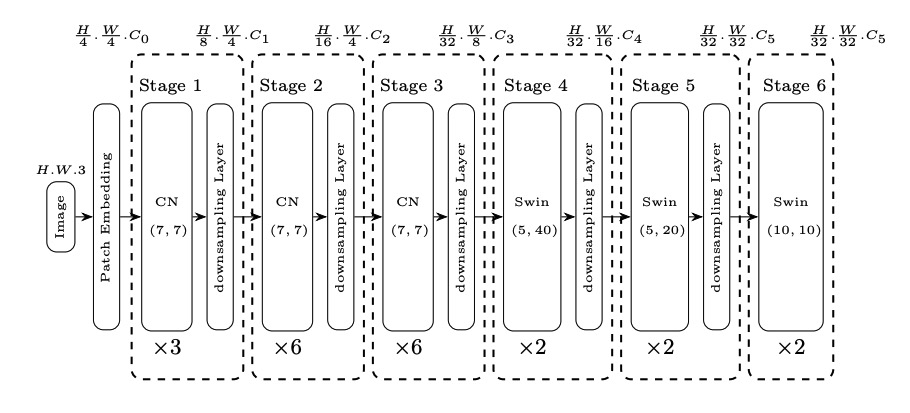

# DocParser: End-to-end OCR-free Information Extraction from Visually Rich Documents

This is an unofficial Pytorch implementation of DocParser.

<figure class="image">
  
  <figcaption>The architecture of DocParser's Encoder</figcaption>
</figure>

## News
- July 15th, update training scripts for Masked Document Reading Task and model architecture.

## How to use
### 1. set up environment
```shell
pip install requirements.txt
```

### 2. prepare dataset
The dataset should be processed into the following format
```json
{
  "filepath": xxx, // path to image folder
  "filename": xxx, // image name
  "extract_info": {
    "ocr_info": [
      {
        "chunk": "text1"
      },
      {
        "chunk": "text2"
      },
      {
        "chunk": "text3"
      }
    ]
  } // a list of ocr info of filepath/filename 
}
```
### 3. start training
You can start the training from ```train/train_experiment.py``` or

```shell
python train/train_experiment.py --config_file config/base.yaml
```
The training script also support ddp with huggingface/accelerate by
```shell
accelerate train/train_experiment.py --config_file config/base.yaml --use_accelerate True
```
### 4. notes
The training script currently solely implements the **Masked Document Reading Step** described in the paper. The decoder weights, tokenizer and processor are borrowed from [naver-clova-ix/donut-base](https://huggingface.co/naver-clova-ix/donut-base)